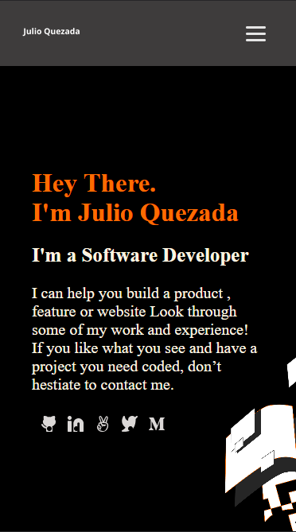

<a name="readme-top">My porfolio</a>


<div align="center">
  
  <br/>

  <h3><b>My Portfolio</b></h3>

</div>

<!-- TABLE OF CONTENTS -->

# 📗 Table of Contents

- [📖 About the Project](#about-project)
  - [🛠 Built With](#built-with)
    - [Tech Stack](#tech-stack)
    - [Key Features](#key-features)
  - [🚀 Live Demo](#live-demo)
- [💻 Getting Started](#getting-started)
  - [Setup](#setup)
  - [Prerequisites](#prerequisites)
  - [Install](#install)
  - [Usage](#usage)
  - [Run tests](#run-tests)
  - [Deployment](#deployment)
- [👥 Authors](#authors)
- [🔭 Future Features](#future-features)
- [🤝 Contributing](#contributing)
- [⭐️ Show your support](#support)
- [🙏 Acknowledgements](#acknowledgements)
- [❓ FAQ (OPTIONAL)](#faq)
- [📝 License](#license)

<!-- PROJECT DESCRIPTION -->

# 📖 My Portfolio <a name="about-project"></a>

**[Welcome to My Porfolio]** where you can explore my projects, get to know me, and find a way to contact me. Take a look at my various projects and discover the range of my technical skills. Whether you are interested in web development, software engineering, or data science, you'll find a variety of projects here to pique your interest. So feel free to browse, learn more about me and my work, and get in touch if you have any questions or opportunities to collaborate.

## 🛠 Built With <a name="built-with"></a>

### Tech Stack <a name="tech-stack"></a>

<details>
  <summary>Client</summary>
  <ul>
    <li><a href="https://developer.mozilla.org/es/docs/Learn/HTML">HTML</a></li>
    <li><a href="https://developer.mozilla.org/es/docs/Web/CSS">CSS</a></li>
  </ul>
</details>


<!-- Features -->

### Key Features <a name="key-features"></a>

- **[A fully functional contact form.]**
- **[Mobile first porfolio.]**
- **[Only using semantic HTML.]**

<p align="right">(<a href="#readme-top">back to top</a>)</p>

<!-- LIVE DEMO -->

## 🚀 Live Demo <a name="live-demo"></a>

- [Live Demo Link](https://alejandroq12.github.io/portfolio/)

<p align="right">(<a href="#readme-top">back to top</a>)</p>

<!-- GETTING STARTED -->

## 💻 Getting Started <a name="getting-started"></a>

To get a local copy up and running, follow these steps:

### Prerequisites

In order to run this project you need:

1. A web browser to see the website/porfolio.

2. And a code editor if you want to edit the code. For example, Vs Code.

### Setup

Clone this repository to your desired folder:

1. Clone it using your terminal: git clone https://github.com/Alejandroq12/portfolio.git

2. If the previous method does not work you may also download the repo as a .zip file and once you decompress the .zip file you are ready to use it.

Important: do not forget to clone the repo in the correct folder, probably you will use the following commands to achieve that in your terminal:

1. To navigate a certain folder:

```
cd <folder name>
```
2. To navigate to the previous folder: 

```
cd ..
```

### Install

Install this project with:

1. To see this project you will not need to install something else.

2. But in case you want to test the linter that I configured to check errors you will have to complete the following steps:

```
npm init -y
npm install --save-dev hint@7.x
```

3. If you run npm install do not forget to create a .gitignore file to prevent the node_modules to be uploaded to GitHub:

.gitignore

node_modules/

### Usage

To see this project you will only need to:

1. Open the index.html file with a web browser.

### Run tests

To run tests, run the following command:

```
npx hint .

```

### Deployment

You can deploy this project using GitHub pages:

1. Log in to your GitHub account and navigate to the repository that contains your website files.
2. Make sure that your website files are located in the main branch and in the root directory of the repository.
3. If your website is not already live, make sure that the index.html file is the main page of your website.
4. Click on the "Settings" tab in your repository.
5. Scroll down to the "GitHub Pages" section.
6. In the "Source" dropdown menu, select the branch where your website files are located. For a simple website with only HTML and CSS, this is typically the main branch.
7. In the "Path" field, make sure that the root directory is specified (i.e., "/").
8. Click "Save" to generate your website.
9. Wait a few minutes for GitHub to build and deploy your website.
10. Once the website is deployed, visit the GitHub Pages URL to view your site.

<p align="right">(<a href="#readme-top">back to top</a>)</p>

<!-- AUTHORS -->

## 👥 Authors <a name="authors"></a>

👤 **Julio Quezada**

- GitHub: [Alejandroq12](https://github.com/Alejandroq12)
- Twitter: [@JulioAle54](https://twitter.com/JulioAle54)
- LinkedIn: [Julio Quezada](https://www.linkedin.com/in/quezadajulio/)

👤 **Juan Sanchez**

- GitHub: [J-C-S-V](https://github.com/J-C-S-V)
- Twitter: [@juansan0](https://twitter.com/juansan0)

<p align="right">(<a href="#readme-top">back to top</a>)</p>

<!-- FUTURE FEATURES -->

## 🔭 Future Features <a name="future-features"></a>

> Describe 1 - 3 features you will add to the project.

- [ ] **[I will add the desktop version]**
- [ ] **[I will add media queries to make responsive]**
- [ ] **[I will use JavaScript to add interactivity]**

<p align="right">(<a href="#readme-top">back to top</a>)</p>

<!-- CONTRIBUTING -->

## 🤝 Contributing <a name="contributing"></a>

Contributions, issues, and feature requests are welcome!

Feel free to check the [issues page](../../issues/).

<p align="right">(<a href="#readme-top">back to top</a>)</p>

<!-- SUPPORT -->

## ⭐️ Show your support <a name="support"></a>

If you like this project please give a star.
Thanks in advance.
<p align="right">(<a href="#readme-top">back to top</a>)</p>

<!-- ACKNOWLEDGEMENTS -->

## 🙏 Acknowledgments <a name="acknowledgements"></a>

I would like to thank Wes Bos because I learned how to implement flexbox with his free tutorial:
- Wes Bos: [Wes Bos](https://flexbox.io/)

<p align="right">(<a href="#readme-top">back to top</a>)</p>

<!-- FAQ (optional) -->

## ❓ FAQ (OPTIONAL) <a name="faq"></a>

- **[Are you goin to use React in the future?]**

  - [Yes! I will transform this portfolio into a React App.]

- **[Did you create this porfolio from scratch?]**

  - [Yes! From zero, and I will improve it a lot.]

<p align="right">(<a href="#readme-top">back to top</a>)</p>

<!-- LICENSE -->

## 📝 License <a name="license"></a>

This project is [MIT](./MIT.md) licensed.

<p align="right">(<a href="#readme-top">back to top</a>)</p>
