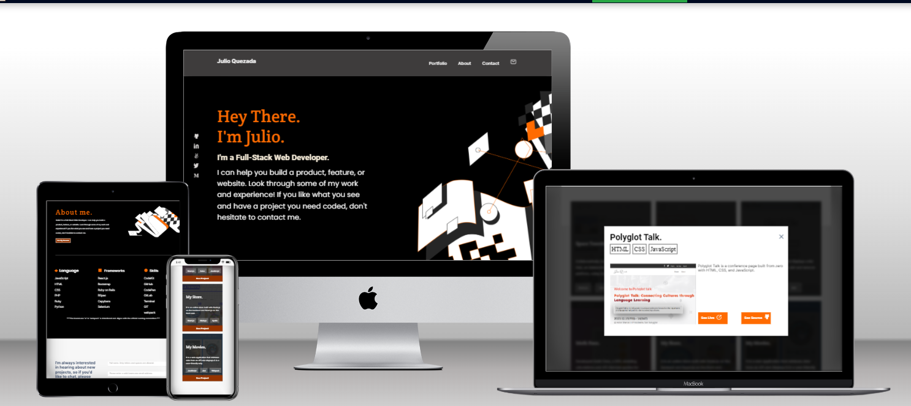

# quezadajulio.com

> The source code behind my personal portfolio. A fast, mobile first site that serves as my public landing page for work, writing, and contact.

<p>
  
  
  
  
  
</p>

<div align="center">
  
</div>

**Live site:** [quezadajulio.com](https://quezadajulio.com)

---

## About

My portfolio is where you can explore my work, get to know me as an engineer, and reach out to start a conversation. The site showcases real projects across backend and full stack development, with enough detail for recruiters and engineering managers to evaluate fit quickly. If you are hiring for a remote backend role or considering a collaboration, this is the best place to start.

---

## The Problem

Every backend developer targeting international remote roles needs a single URL that works as their public anchor. A place that loads fast, looks professional on any device, lists real projects, and gives people a way to reach out. I wanted full control over that surface. The wording, the structure, the performance. Without being locked into a template platform or a framework I did not need for a static site.

## The Approach

A hand written static site. Semantic HTML, plain CSS with flexbox and media queries, and vanilla JavaScript for the contact form and small interactions. No framework, no build step, no runtime. The whole site is served from GitHub Pages with a custom domain managed through Namecheap DNS. That choice keeps the page fast, keeps the source readable to anyone who clones it, and removes every moving part that could break between deploys.

The project has evolved across nearly 500 commits over three years, which reflects how a personal site should be treated. A living surface that gets maintained and improved, not a snapshot frozen at launch.

---

## Key Decisions

### Why no framework

The site is under a dozen pages of content and has no dynamic data. Pulling in React or a static site generator would have added build tooling, bundle size, and ongoing maintenance for zero user facing benefit. Plain HTML and CSS render instantly and will still work in ten years without a toolchain update. If the site grows into something with real dynamic content like a blog or a project dashboard, I will migrate then, not preemptively.

### Why mobile first

Most first time visitors land here from a LinkedIn message or a recruiter search on their phone. Designing for small screens first and scaling up kept the layout disciplined and prevented the common failure mode of a desktop design that collapses awkwardly on mobile.

### Why semantic HTML strictly

Screen readers, SEO, and maintainability all benefit from using the right tag for the right job. The cost is zero. The payoff is a site that is accessible by default and easier to read when I come back to edit it six months later.

### Why GitHub Pages plus Namecheap DNS

Free hosting, global CDN, automatic HTTPS through GitHub, and full control of the domain. The CNAME file in this repo is the only configuration required. Deployment is a git push. There is no cheaper or simpler stack for a static personal site, and no reason to pay for managed hosting at this scale.

---

## Tech Stack

| Layer | Technology |
|-------|-----------|
| Markup | HTML5, semantic |
| Styling | CSS3 with flexbox, grid, media queries |
| Behavior | Vanilla JavaScript |
| Linting | webhint, stylelint, eslint |
| CI | GitHub Actions |
| Hosting | GitHub Pages |
| DNS | Namecheap with custom domain |

---

## Running Locally

```bash
git clone https://github.com/Alejandroq12/quezadajulio.com.git
cd quezadajulio.com
```

Open `index.html` directly in a browser, or serve it with any static server:

```bash
npx serve .
```

### Optional: run the linters

```bash
npm install
npx hint .
npx stylelint "**/*.css"
npx eslint js/
```

---

## Project Structure

```
assets/         Images, icons, logo, and static media
js/             JavaScript modules for form handling and interactions
index.html      Entry point
CNAME           Custom domain configuration for GitHub Pages
```

---

## What I Learned

Building this site taught me to stop reaching for tools before the problem justifies them. An earlier draft of the portfolio used a bundler and a framework. The final version works better, loads faster, and takes less time to change, because the tooling was removed rather than added. That lesson shapes how I evaluate architectural decisions in backend work now. Start with the simplest thing that solves the problem, and add complexity only when the problem actually demands it.

---

## Roadmap

* Add a writing section with technical posts from my Medium archive
* Integrate a simple view counter using a serverless function
* Audit and improve Lighthouse scores across all pages
* Add an open source contributions section once my first external PR is merged

---

## About Me

I am Julio Quezada, a backend .NET developer from El Salvador with experience building production systems at national scale. I specialize in C#, ASP.NET Core, and PostgreSQL.

**Open to remote backend roles** across US, EU, and LATAM time zones.

[Portfolio](https://www.quezadajulio.com) · [LinkedIn](https://www.linkedin.com/in/jqdeveloper) · qjuliodev@gmail.com

---

## License

MIT. See [MIT.md](./MIT.md) for details.
